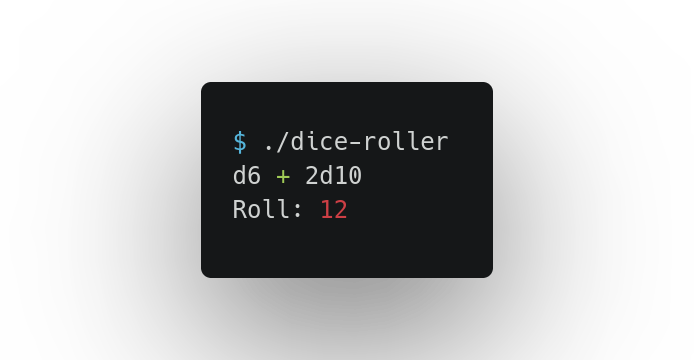

# Dice roller

A dice roller algorithm implemented in Rust.



## 🎯 Features

- Is able to do addition and subtraction.
- Handle string expressions like `2d12 - d10 + 5d6`.

## 🔧 Installation

```bash
# Clone
$ git clone http://github.com/juanbelieni/dice-roller.git

# Build
$ cargo build --release
```


## 🔭 Usage

```bash
# After build
./target/release/dice-roller
```


## 📪 Contributing

1. Fork the Project
2. Create your Feature Branch: `git checkout -b feature/your-feature`
3. Commit your Changes: `git commit -m 'Add your-feature'`
4. Push to the Branch: `git push origin feature/your-feature`
5. Open a Pull Request

## ✉ Contact
Twitter: [@juanbelieni](https://twitter.com/juanbelieni) | Email: [juanbelieni@gmail.com](mailto:juanbelieni@gmail.com)

